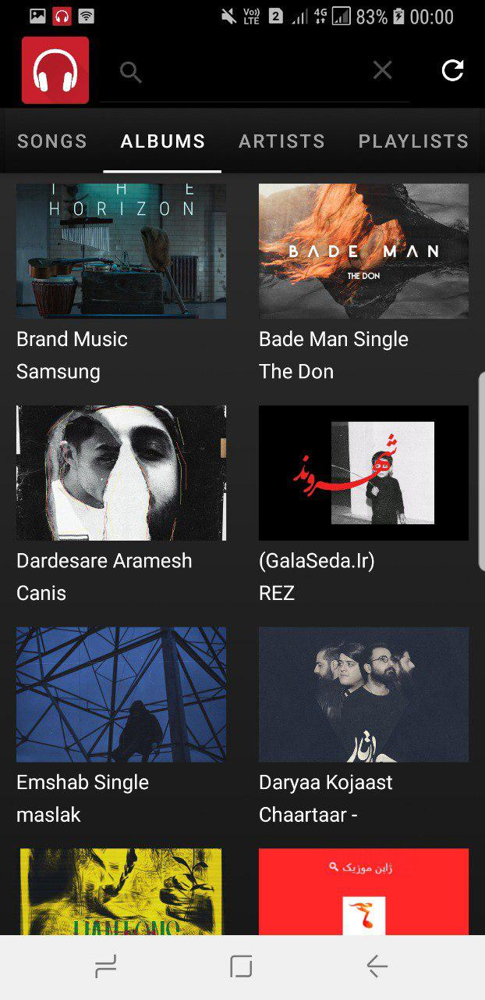

# android_music_player
music player for android generated with the android studio (java) used cursor in media store provider and find local music, used ORM green Dao database for uses like playlist and favorite songs, support lyrics adding for the song and sync playing with the song, UI used material design components.

